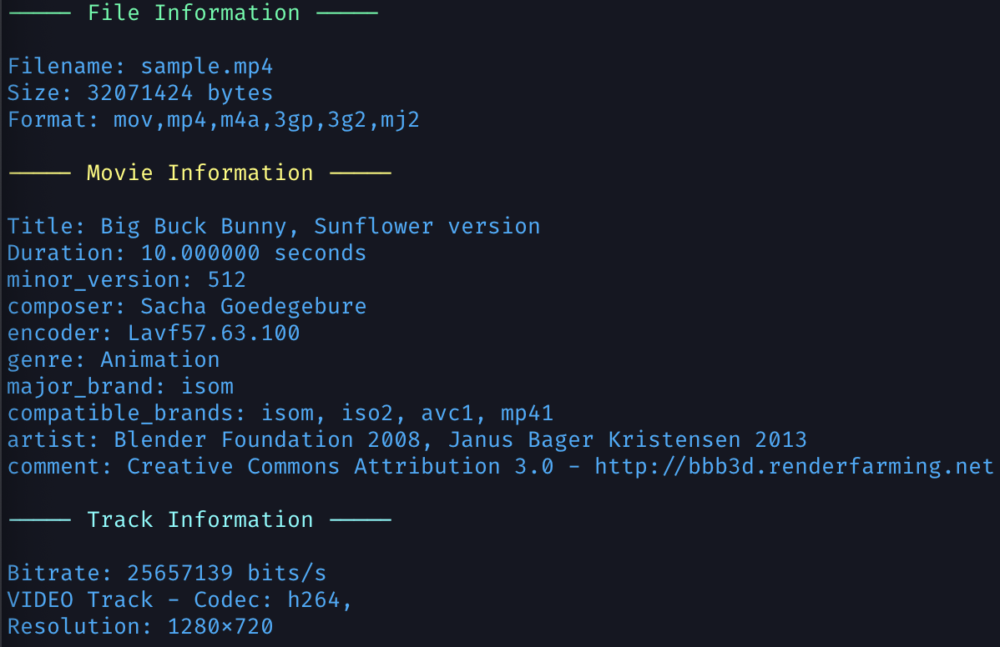

# 🎬 vme - Video Metadata Extractor

[](https://goreportcard.com/report/github.com/joeldelpilar/vme)
[](https://opensource.org/licenses/MIT)
[](https://github.com/joeldelpilar/vme/actions/workflows/go-tests.yml)
[](https://codecov.io/gh/joeldelpilar/vme)

A command-line tool to extract metadata from MP4 video files.

## 🌟 Features

*   Extract basic, extended, or full metadata from MP4 files.
*   Supports file information, movie information (tags, title, duration), and track information (bitrate, codecs, resolution).
*   Export metadata as JSON or XML files.
*   Upload metadata directly to S3-compatible storage services including AWS S3 and MinIO.
*   Clear and formatted output to the console.

## 🛠️ Installation

1.  **Prerequisites:**
    *   [Go](https://go.dev/dl/) (version 1.22 or later)
    *   [FFmpeg](https://ffmpeg.org/download.html) (with `ffprobe` available in your system's PATH)

2.  **Get the package:**

    ```bash
    go install github.com/joeldelpilar/vme@latest
    ```

## 🚀 Usage

```bash
vme [flags] <mp4-file>
```

### 🔍 Flags

*   `-b`: Basic metadata (file information only).
*   `-e`: Extended metadata (file and movie information).
*   `-f`: Full metadata (file, movie, and track information).
*   `-o`: Output format (json/xml) - exports metadata to a file instead of console output.

#### S3 Integration Flags

*   `-s3-upload`: Enable uploading metadata files to S3 storage.
*   `-s3-bucket`: S3 bucket name (required when using -s3-upload).
*   `-s3-region`: AWS region (default: "us-east-1").
*   `-s3-endpoint`: Custom endpoint URL for S3-compatible services like MinIO.
*   `-s3-ssl`: Use SSL for S3 connection (default: true, set to false for local development).

### 🌍 Environment Variables

When using S3 integration, the following environment variables are required:

*   `VME_S3_ACCESS_KEY`: S3 access key for authentication.
*   `VME_S3_SECRET_KEY`: S3 secret key for authentication.

### 🛠️ Make Commands

To enable the installation of the `vme` command, you can use the following commands:

```bash
make build
make install
make clean
```

### Examples

*   Extract basic metadata:

    ```bash
    vme -b video.mp4
    ```

*   Extract extended metadata:

    ```bash
    vme -e video.mp4
    ```

*   Extract full metadata:

    ```bash
    vme -f video.mp4
    ```

*   Export metadata as JSON:

    ```bash
    vme -f -o json video.mp4
    ```

*   Export metadata as XML:

    ```bash
    vme -f -o xml video.mp4
    ```

*   Export metadata and upload to AWS S3:

    ```bash
    # Set environment variables first
    export VME_S3_ACCESS_KEY=your_access_key
    export VME_S3_SECRET_KEY=your_secret_key
    
    # Then run the command
    vme -f -o json -s3-upload -s3-bucket my-bucket video.mp4
    ```

*   Export metadata and upload to MinIO:

    ```bash
    # Set environment variables first
    export VME_S3_ACCESS_KEY=minioadmin  # or your custom access key
    export VME_S3_SECRET_KEY=minioadmin  # or your custom secret key
    
    # Then run the command
    vme -f -o json -s3-upload -s3-bucket test-bucket -s3-endpoint <Your-s3-endpoint> -s3-ssl=<true/false> video.mp4
    ```

When using the `-o` flag and not using the `-s3-upload` flag, the metadata will be exported to a file named `<input-filename>-metadata.<format>` in the current directory. For example, if your input file is `video.mp4` and you use `-o json`, the output will be saved as `video-metadata.json`.

#### Example output


## 🧪 Local Testing with Docker

If you want to test the S3 functionality locally without using actual cloud services, you can use MinIO running in Docker.

### Setting Up MinIO in Docker

1. Start MinIO with Docker:

   ```bash
   docker run -p 9000:9000 -p 9001:9001 --name minio \
     -e "MINIO_ROOT_USER=minioadmin" \
     -e "MINIO_ROOT_PASSWORD=minioadmin" \
     bitnami/minio:latest
   ```

2. Access the MinIO web interface at http://localhost:9001 and log in with:
   - Username: `minioadmin`
   - Password: `minioadmin`

3. Create a new bucket (e.g., "test-bucket") through the web interface.

### Using vme with Local MinIO

Once MinIO is running, you can use vme to upload metadata to it:

```bash
# Set environment variables for authentication
export VME_S3_ACCESS_KEY=minioadmin
export VME_S3_SECRET_KEY=minioadmin

# Extract and upload metadata to local MinIO
vme -f -o json -s3-upload -s3-bucket test-bucket -s3-endpoint http://localhost:9000 -s3-ssl=false video.mp4
```

This setup is perfect for development and testing of the S3 integration functionality without requiring actual cloud resources.

## ⚙️ How it Works

The tool uses `ffprobe` (from the FFmpeg suite) to analyze the MP4 file and extract metadata. The extracted data is then formatted and displayed in the console or exported to a file in the specified format.

When using S3 integration, the tool creates a client to the specified S3 service (AWS S3 or a compatible alternative like MinIO) and uploads the exported metadata file.

## 📝 License

This project is licensed under the MIT License - see the [LICENSE](LICENSE) file for details.

## 🤝 Contributing

Contributions are welcome! Please feel free to submit a pull request or open an issue.

## 👨‍💻 Author

*   Joel del Pilar - [GitHub](https://github.com/joeldelpilar)

## 🙏 Acknowledgments

*   Uses the [FFmpeg](https://ffmpeg.org/) project for media analysis.
*   Inspired by the need for a simple and effective MP4 metadata extraction tool.
